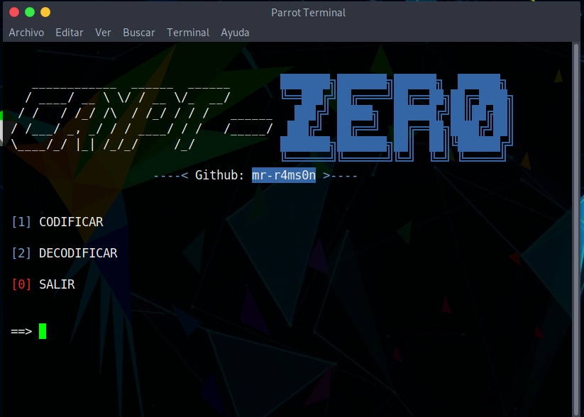
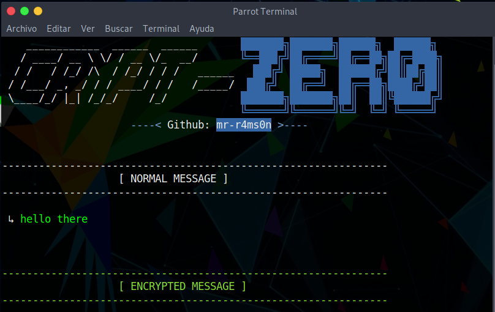
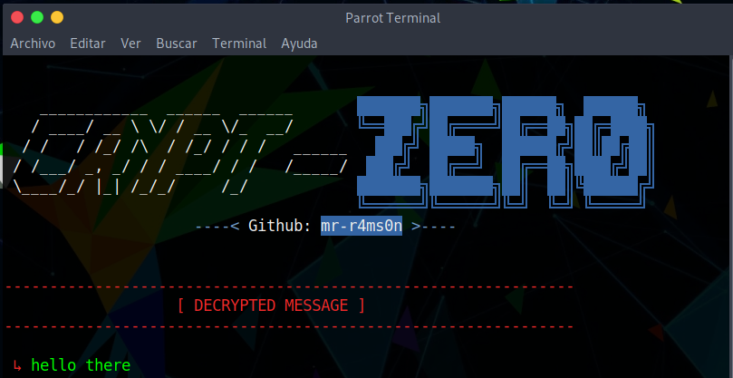

# Crypt-Zer0
Encripta y desencripta mensajes.



### Encriptar:


### Desencriptar:



#### Caracteres:

```
signos = ['+','-','_','!','#','$','%','&','/','(',')',
'=','?','¿', '°','[',']','{','}',',','.','*','@','¡',
'>','<','~',]

números = ['0', '1','2','3','4','5','6','7','8','9']

raros = ['Ç','ü','é','â','ä','à','å','ç','ê','ë','è',
'ï','î','ì','Ä','Å','É','æ','Æ','ô','ö','ò','û','ù',
'ÿ','Ö','Ü','ø','£','Ø','×','ƒ','ñ','Ñ','ª','®','¬',
'½','¼','¾','«','»','á','í','ú','é','ó']
```

### Instalación:
```
git clone https://github.com/mr-r4ms0n/Crypt-zer0.git
cd Crypt-Zer0
python3 crypt-zer0.py
```
